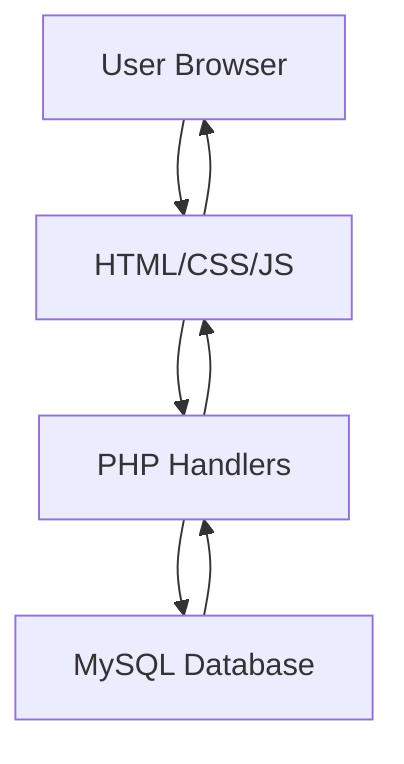

# 🌍 Travel Buddy Matcher

A web platform connecting like-minded travelers to explore destinations together through profile matching and trip coordination.

## Table of Contents
- [Project Overview](#project-overview)
- [Key Features](#key-features)
- [Tech Stack](#tech-stack)
- [System Architecture](#system-architecture)
- [Installation](#installation)
- [Usage](#usage)
- [Future Developments](#future-developments)
- [Contributor](#contributor)

## Project Overview
The Travel Buddy Matcher enables users to:
- Create personalized travel profiles
- List upcoming trips with destination details
- Connect with compatible travel companions
- Manage connection requests and approvals

**By:** Ruthvik Akula (70572200028)

## Key Features

### 👤 User Profiles
- **Secure Authentication**: Login/Signup system
- **Profile Management**: 
  - Upload profile photos
  - Add social media links
  - Update travel preferences

### ✈️ Trip Management
- **Create Trips**: 
  - Destination details
  - Travel dates
  - Preferred travel style
- **Edit/Delete**: Flexible trip updates

### 🤝 Connection System
- **Smart Matching**: Find compatible travel buddies
- **Request Flow**:
  - Send/Receive connection requests
  - Approval status tracking
- **Post-Approval**: Shared contact info (WhatsApp/Instagram/Discord)

## Tech Stack

Component | Technology
---|---
Frontend | HTML5, CSS3, JavaScript, Bootstrap
Backend | PHP
Database | MySQL (XAMPP)
Authentication | Session-based
Hosting | Local (XAMPP) / GitHub Pages (Frontend)

## System Architecture



## Installation

### Prerequisites
- [XAMPP](https://www.apachefriends.org/download.html)
- Web browser
- Git (optional)

### Setup Steps
1. Clone repository:
   ```bash
   git clone https://github.com/ruth0107/Travel-Buddy-Matcher.git
   ```
2. Move to XAMPP's htdocs:
   ```bash
   mv Travel-Buddy-Matcher C:/xampp/htdocs/
   ```
3. Import database:
   - Access phpMyAdmin at `http://localhost/phpmyadmin`
   - Import `database/travel_buddy.sql`

4. Configure:
   ```php
   // config.php
   define('DB_SERVER', 'localhost');
   define('DB_USERNAME', 'root');
   define('DB_PASSWORD', '');
   ```

5. Launch:
   ```bash
   http://localhost/Travel-Buddy-Matcher/
   ```

## Usage
1. **New Users**: Sign up via registration page
2. **Create Profile**: Add travel preferences
3. **List Trips**: Enter destination details
4. **Find Buddies**: Browse compatible profiles
5. **Connect**: Send/approve requests

## Future Developments
| Feature | Status |
|---------|--------|
| Enhanced Matching Algorithm | Planned |
| Group Trip Planning | In Development |
| Global Destination Expansion | Research Phase |
| Mobile Application | Future Roadmap |

